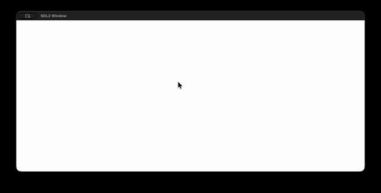

# SandPhysics

A C-based falling sand simulation engine using SDL2.

## Demo



## Prerequisites

- **C Compiler**: GCC or Clang (supporting C11).
- **SDL2 Library**:
  - **macOS**: `brew install sdl2`
  - **Debian/Ubuntu**: `sudo apt-get install libsdl2-dev`
  - **Fedora**: `sudo dnf install SDL2-devel`

## Compilation

The project uses a `Makefile` for building.

**Note for macOS users**: The `Makefile` currently expects `sdl2-config` to be located at `/opt/homebrew/bin/sdl2-config`. If your installation is different (e.g., Intel Mac or Linux), you may need to edit the `SDL_CONFIG` variable in the `Makefile` or override it:

```bash
make SDL_CONFIG=$(which sdl2-config)
```

To build the project:

```bash
make
```

To clean build artifacts:

```bash
make clean
```

## Running

After compilation, you can run the simulation directly or via `make`:

```bash
./SandPhysics
```

or

```bash
make run
```

## Configuration

You can tweak the simulation parameters by modifying the source header files and recompiling.

| Parameter | File | Description |
|-----------|------|-------------|
| **Window Dimensions** | `includes/sdl_utils.h` | Modify `WINDOW_WIDTH` and `WINDOW_HEIGHT`. |
| **Cell Size** | `includes/cell_types.h` | Modify `CELL_LENGTH` to change pixel size of grains. |
| **Brush Settings** | `includes/cell_types.h` | Modify `SPREAD_SCOPE` and `SPREAD_DENSITY` for spawn behavior. |
| **Simulation Speed** | `src/main.c` | Modify `GAME_SPEED` (lower value = faster). |

## Controls

- **Left Mouse Button (Hold)**: Spawn sand particles at the cursor location.
